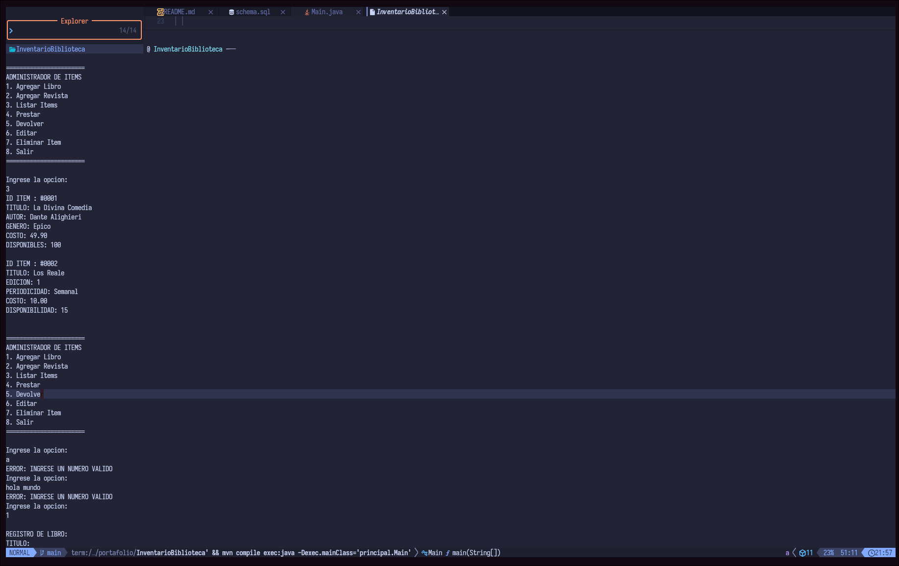
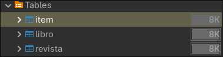
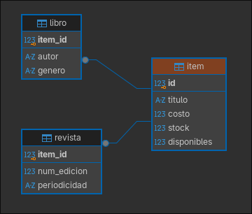

# 📚 InventarioBiblioteca

Sistema de gestión de biblioteca desarrollado en Java, con foco en aplicar Programación Orientada a Objetos, patrones de diseño y persistencia real de forma deliberada.

## Características

- CRUD completo sobre libros y revistas, persistido en PostgreSQL (no en memoria)
- Generación automática de ID (nunca lo ingresa el usuario, para evitar duplicados)
- Gestión de stock: cada título puede tener múltiples copias (`stock` / `disponibles`)
- Préstamo y devolución de ítems, con manejo de errores cuando no hay copias disponibles
- Edición de costo y stock (con ajuste positivo/negativo), y eliminación de ítems
- Listado de todo el inventario reconstruido desde la base de datos
- Validación robusta de entrada por consola: reintenta automáticamente si el usuario ingresa un tipo de dato incorrecto, sin romper el programa
- Manejo de errores por capas: fallos de base de datos y reglas de negocio (ej. "sin stock disponible") se distinguen y se comunican al usuario con mensajes claros, sin cortar el programa

## Tecnologías

- Java 26
- Maven
- PostgreSQL + JDBC (driver oficial `org.postgresql:postgresql`)

## Arquitectura y patrones de diseño

```
principal/  → Main.java — menú, flujo del programa y manejo de excepciones
clases/     → ItemBiblioteca (abstracta), Libro, Revista
organizador/→ GestorCsv, GestorItems
utilidades/ → Lector, ItemFactory
persistencia/   → Conexion, ItemDAO
```

### Patrón Factory
`ItemFactory` centraliza la creación de `Libro` y `Revista` mediante métodos estáticos sobrecargados, evitando lógica condicional repetida en el resto del programa.

### Patrón DAO (Data Access Object)
`ItemDAO` aísla toda la lógica de acceso a PostgreSQL (SQL, `PreparedStatement`, mapeo de filas a objetos) del resto del programa. `GestorItems` no sabe nada de SQL — solo le pide al DAO que guarde, busque o elimine.

### Herencia y polimorfismo
`ItemBiblioteca` es una clase abstracta que define comportamiento común (`prestar()`, `devolver()`) y declara `getInfo()` como abstracto, forzando a `Libro` y `Revista` a implementar su propia representación de información.

### Modelo de datos: herencia de tablas (table-per-subclass)
La jerarquía de clases se refleja en el esquema SQL: una tabla `items` con los atributos comunes, y tablas `libros`/`revistas` con clave foránea `item_id REFERENCES items(id) ON DELETE CASCADE`, evitando registros huérfanos al eliminar un ítem.

### Principio de responsabilidad única
Cada clase tiene un único motivo para cambiar: `ItemFactory` crea, `ItemDAO` persiste, `GestorItems` orquesta reglas de negocio, `Lector` valida entrada, `Main` interactúa con el usuario.

### Manejo de excepciones por capas
- `SQLException` (chequeada, de infraestructura) sube desde `Conexion`/`ItemDAO` hasta `Main`, donde se atrapa y se le muestra un mensaje claro al usuario sin cortar el programa.
- `IllegalStateException` (no chequeada, regla de negocio — ej. "no hay copias disponibles") se maneja en el mismo punto, manteniendo el criterio de que `Main` es la única capa responsable de comunicarse con el usuario.
- Todos los recursos de JDBC (`Connection`, `PreparedStatement`, `ResultSet`) se manejan con `try-with-resources`.

### Encapsulamiento
Todos los atributos de las clases del modelo son `private`, expuestos únicamente mediante getters y, cuando corresponde, setters controlados. Los atributos que no deberían cambiar tras la creación (autor, género, edición, periodicidad) son inmutables. El ID se asigna una única vez, generado por PostgreSQL, mediante un método dedicado (`asignarIdGenerado`) en lugar de un setter genérico.

### Seguridad
Las credenciales de la base de datos se leen desde variables de entorno (`DB_USER`, `DB_PASSWORD`), nunca están hardcodeadas en el código fuente.

## Cómo ejecutar

```bash
git clone https://github.com/[tu-usuario]/InventarioBiblioteca.git
cd InventarioBiblioteca

export DB_USER="tu_usuario"
export DB_PASSWORD="tu_contraseña"

mvn compile
mvn exec:java -Dexec.mainClass="principal.Main"
```

Necesitás una base PostgreSQL con las tablas creadas — ver `schema.sql` en la raíz del proyecto.

## Capturas





## Autor

Angello Ramos - Proyecto Personal
